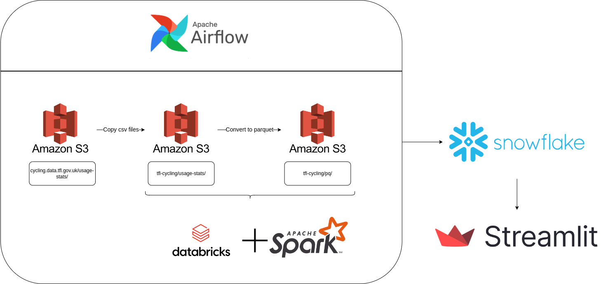
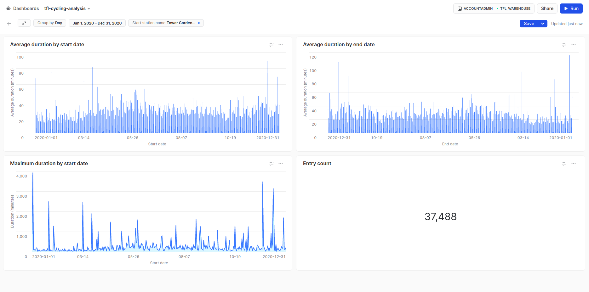

# Overview
The project processes the public data provid by Transport for London, a local government body responsible for most of the transport network in London, United Kingdom. In particular, the project focuses on rented bicycles usage data from 2015 until 2022. It can be accessed [here](https://cycling.data.tfl.gov.uk/)

# Dataset Schema

| Features          | Data type | Descriptions                                |
| ----------------- | --------- | ------------------------------------------- |
| Rental ID         | Integer   | Unique rental ID                            |
| Duration          | Double    | Duration in seconds                         |
| Bike Id           | Integer   | Unique bike ID                              |
| End Date          | Timestamp | The date where the bike is returned         |
| EndStation Id     | Integer   | The ID of the end station                   |
| EndStation Name   | String    | The station name where the bike is returned |
| Start Date        | Timestamp | The date where the bike is rented           |
| StartStation Id   | Integer   | The ID of the start station                 |
| StartStation Name | String    | The station name where the bike is rented   |

Raw dataset size: ~352 CSV - 10.4 GB.  
RAW dataset record count: ~84.4 million rows.

# Architectures

Below is a high-level description of the architecture.

# Snowflake dashboard

A dashboard built in Snowflake. The dashboard has date range, date bucket, and a filter for start station name.

